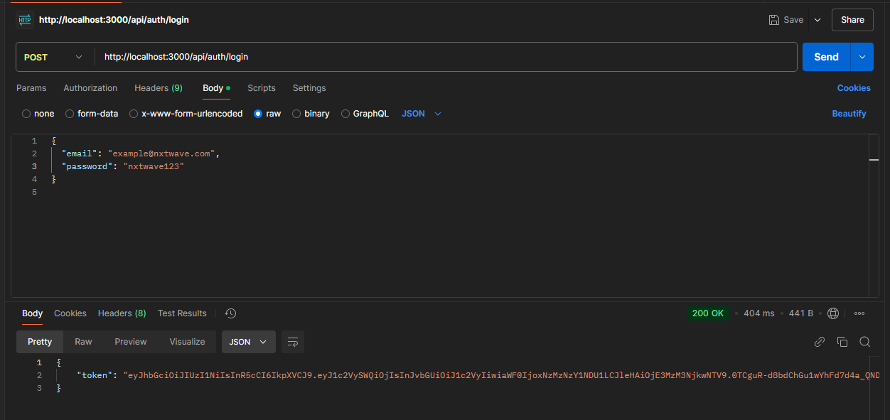
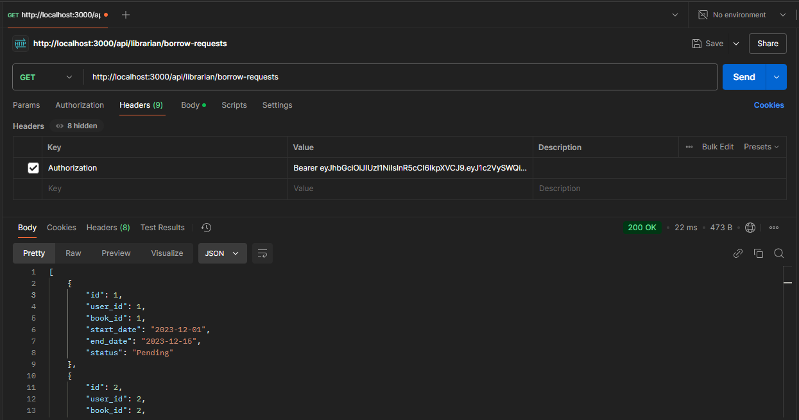
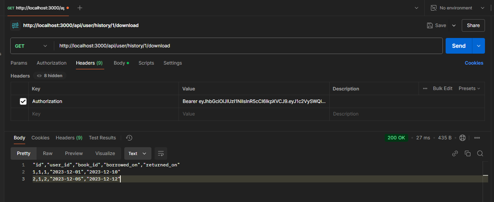

# FOTOOWL Library Management System

## Overview

A Library Management System built with **Node.js**, **Express.js**, **SQLite**, and **JWT Authentication**. This application allows users to borrow books, manage requests, view history, and integrates role-based access for librarians and users.

## Features

### Authentication

- Basic authentication with `bcryptjs`.
- JWT-based authentication using `jsonwebtoken`.

### User Actions

- Register/Login functionality.
- Submit borrow requests.
- View borrowing history.

### Librarian Actions

- Approve/Deny borrow requests.
- View and manage borrow requests.

### Additional Features

- Download borrow history as CSV using `json2csv`.
- Secure data management with SQLite.

## GitHub Repository

You can find the complete source code at: [GitHub Repository](https://github.com/PITTAJAGADEESH/fotoowl-library-task)

## Postman Documentation Screenshots

## Below are example Postman endpoint screenshots:

1. **Login Endpoint**  
   This shows a successful token response from the server after sending credentials.  
   

2. **Borrow Requests Endpoint**  
   This demonstrates how borrow requests can be created and viewed through the API.  
   

3. **History CSV Download**  
   This endpoint shows how users can download their borrowing history in CSV format.  
   

## Available Routes

### Authentication Routes

- **POST** `/api/auth/login`: Login a user.
- **POST** `/api/auth/register`: Register a user.

### Librarian Routes

- **GET** `/api/librarian/borrow-requests`: View borrow requests.
- **PUT** `/api/librarian/borrow-requests/:id/approve`: Approve borrow requests.
- **PUT** `/api/librarian/borrow-requests/:id/deny`: Deny borrow requests.

### User Routes

- **POST** `/api/user/borrow-requests`: Submit a borrow request.
- **GET** `/api/user/history/:id`: View history of borrow requests.
- **GET** `/api/user/history/:id/download`: Download borrowing history in CSV format.

## Deployment

This project is deployed using [Render](https://render.com)

**Live Demo Here:** [Render Deployment](https://fotoowl-library-task.onrender.com)

## Acknowledgements

This project was made possible with tools like Node.js, Express.js, SQLite3, bcrypt, JWT, and other open-source dependencies.
